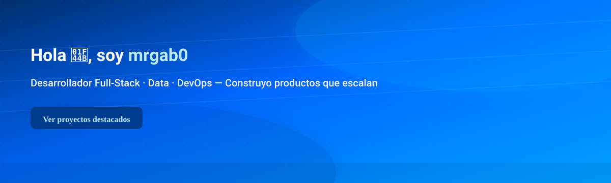

# Hola 👋, soy mrgab0

## Soy [Tu nombre / Alias] — Desarrollador/a Full‑Stack · Data · DevOps
Breve frase de 1 línea sobre lo que haces y qué valor aportas (ej: "Construyo productos que escalan y dan valor a usuarios reales").

<!-- Badges -->

---

<!--last-updated-->Última actualización: 2026-09-07<!--/last-updated-->

## 🧰 Tecnologías y herramientas
- Lenguajes: JavaScript/TypeScript · Python · Go
- Frameworks: React · Node.js · Django
- Infra & DevOps: Docker · Kubernetes · Terraform

## 🔭 Actualmente
Trabajando en: Proyecto X — descripción breve de valor / stack.

## ⭐ Proyectos destacados
- [Proyecto-A](https://github.com/mrgab0/proyecto-a) — 2 frases (qué hace, por qué importa).
- [Proyecto-B](https://github.com/mrgab0/proyecto-b) — 2 frases con stack y resultado.

## 📈 GitHub Stats

<!-- GitHub trophies -->

---

## 📬 Contacto
- Email: tu.email@example.com
- Disponibilidad: abierto a freelance / tiempo completo / proyectos (marca lo que aplique)

Gracias por pasar — si quieres, puedo:
1) Crear el repo `mrgab0/mrgab0` y subir este README.  
2) Añadir un workflow para actualizar "Última actualización" automáticamente cada día.  
3) Ajustar la paleta azul (ej. un azul más oscuro o un degradado) y añadir un banner azul personalizado.
